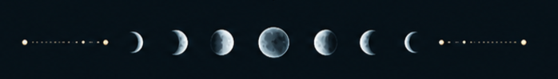
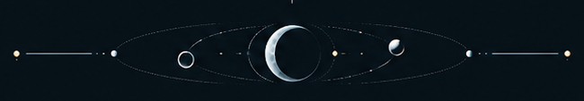
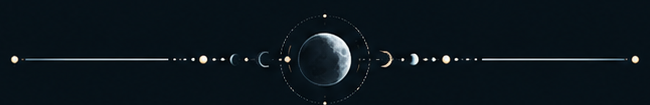

  

## Sobre

Estou cursando **Ciência da Computação**. O que eu realmente estudo com mais frequência hoje é **C++**, **Programação Orientada a Objetos**, **Estruturas de Dados** e **Algoritmos**.

Ainda estou no começo, então este perfil não é uma lista de tecnologias que eu "domino", é mais um registro do que estou aprendendo, errando, refazendo e tentando transformar em projetos que façam sentido para mim.

**HTML, CSS e JavaScript** aparecem por aqui porque resolvi montar meu próprio site e fui mexendo no básico enquanto aprendia, ainda não considero desenvolvimento web uma habilidade consolidada minha.

## Agora

`C++` `POO` `Estruturas de Dados` `Algoritmos`

Faculdade, exercícios, projetos pequenos e algumas experiências fora das aulas.
Git e GitHub também entram nisso: estou aprendendo a usar conforme preciso deles, não colecionando badge para enfeitar perfil.

  

## Projetos

### Ordo

Um gerenciador local de tarefas em **C++**, estou usando o projeto para praticar organização de código e POO fora das listas da faculdade.

`em desenvolvimento` · `projeto de estudo`

### Rakumi Web

Meu site pessoal para juntar projetos, histórias e experimentos. 
Também virou meu laboratório improvisado para mexer em **HTML, CSS e JavaScript** sem fingir que já sei web direito.

`em mudança constante` · `experimento pessoal`

### Fragmentos

Um projeto de ficção sobre uma estação, uma lua grande demais e pessoas que talvez não devessem estar ali. 

`rascunho` · `ficção`

  

  rakumi / 2026 · código, ficção e algumas obsessões

